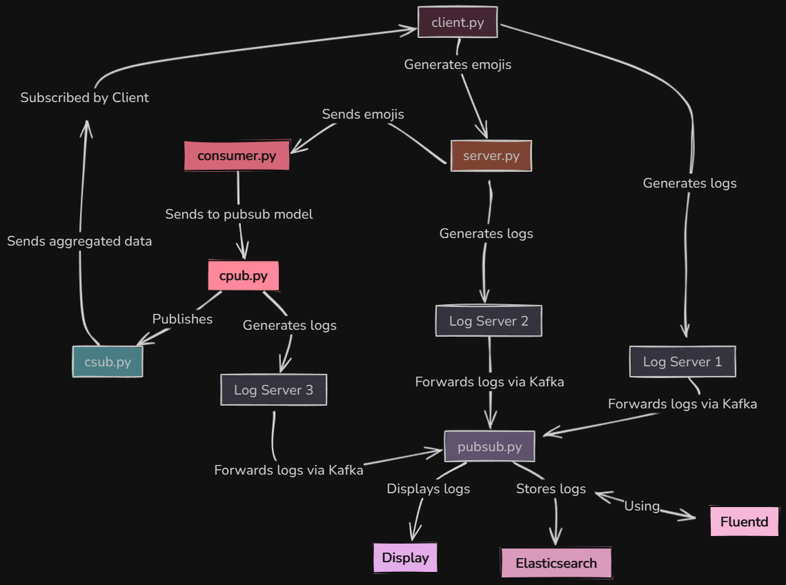

# Distributed Log Emoji Stream



## Quick Start Guide

Run the following commands in order:

1. Start Spark streaming consumer
```bash
spark-submit --packages org.apache.spark:spark-sql-kafka-0-10_2.12:3.0.1 consumer.py > output.txt
```

2. Initialize Fluentd
```bash
fluentd -c fluentd.conf
```

3. Launch servers
```bash
python3 runServers.py
```

4. Start cluster publisher (configurable for 3 clusters by default)
```bash
python3 cpub.py
```

5. Start cluster subscriber (repeat for each cluster)
```bash
python3 csub.py c1
```

6. Start client
```bash
python3 client.py
```

7. Launch publisher/subscriber
```bash
python3 pubsub.py
```

## Monitoring Logs

Query ElasticSearch logs with:
```bash
curl -X GET "localhost:9200/logstash-*/_search?pretty" \
     -H 'Content-Type: application/json' \
     -d'
     {
       "sort": [
         {
           "timestamp": {
             "order": "desc"
           }
         }
       ],
       "size": 3
     }'
```
